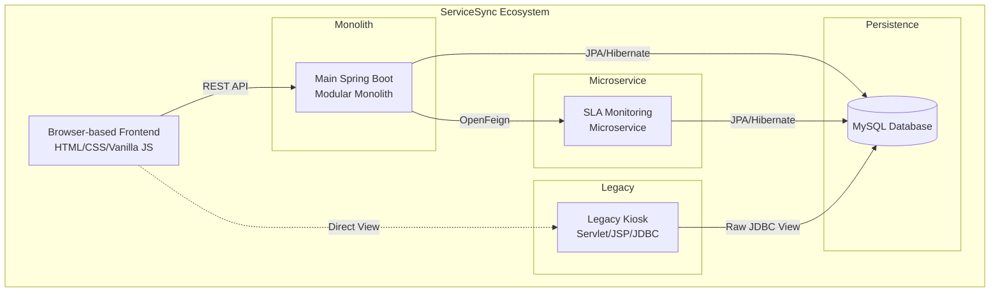
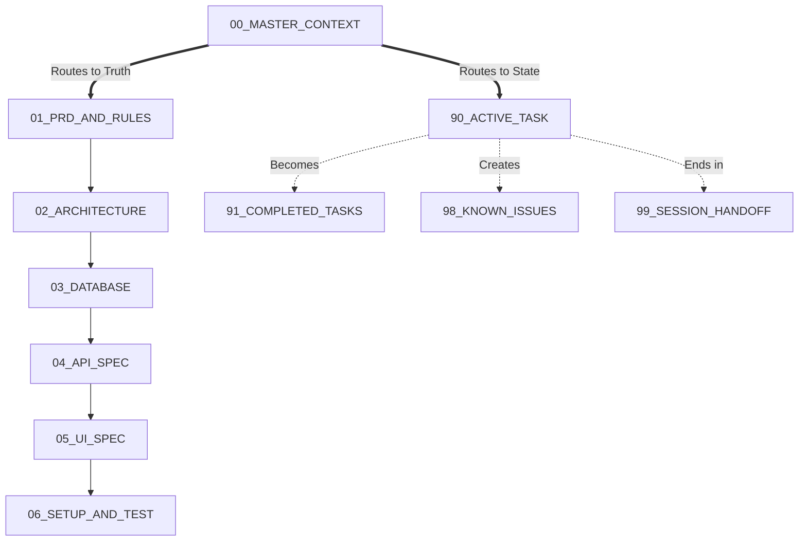

# 1. Document Metadata

| Attribute | Detail |
| --- | --- |
| **Project Name** | ServiceSync |
| **Document Name** | `00_MASTER_CONTEXT.md` |
| **Document Purpose** | Master Routing, Context Loading, and Repository Governance |
| **Version** | 1.0.0 |
| **Status** | **LOCKED / APPROVED** |
| **Authority** | Human Developer ONLY |
| **Documentation Model** | Minimum Viable AI-Context (MVAC) |
| **Last Updated** | September 20, 2026 |
| **Repository Location** | `docs/static/00_MASTER_CONTEXT.md` |
| **Related Documents** | `01_PRD_AND_RULES.md` through `06_SETUP_AND_TEST.md`, plus Dynamic files |

*Note: This document is the master routing and context index. It does NOT contain detailed domain truth (requirements, API specs, database schemas). It dictates WHERE to find that truth and HOW an AI coding agent must operate within the repository.*

---

# 2. Project Identity

* **Project Name:** ServiceSync
* **Product Description:** Enterprise Service Lifecycle and SLA Management Platform
* **Domain:** Appliance and IT repair service-center operations
* **Target Audience/Users:** Repair Shop Administrators, Technicians, and Walk-in Customers
* **Project Level:** Internship-level Java Full Stack Project
* **Primary Objective:** Deliver a complete, multi-module digital workflow system that demonstrates enterprise architecture while adhering to academic curriculum boundaries.
* **Major Capabilities:** Service ticket lifecycle tracking, inventory stock management, async SLA monitoring, legacy-isolated kiosk tracking, and role-based operational execution.

---

# 3. Project Mission

ServiceSync replaces fragmented, paper-based or spreadsheet-based tracking in physical repair centers with a unified digital workflow. It ensures that service tickets progress deterministically, spare parts are atomically deducted from inventory to prevent stock ghosting, and time-sensitive Service Level Agreements (SLAs) are monitored asynchronously. It provides distinct views for administrators, working technicians, and waiting customers.

---

# 4. Validated Architectural Baseline

The system relies on a hybrid architecture designed to satisfy both operational requirements and Java Full Stack curriculum constraints:

* **Primary Application:** Spring Boot Modular Monolith (Ticketing, Inventory, Auth, UI Serving).
* **Microservice:** Dedicated Spring Boot SLA-Monitoring Service (Async reporting, notifications).
* **Legacy Subsystem:** Isolated Servlet/JSP/JDBC Kiosk for physical shop displays.
* **Database:** MySQL 8.x.
* **Persistence:** JPA/Hibernate for the modern monolith; Raw JDBC for the legacy kiosk.
* **Security:** Spring Security with JWT (Stateless). OAuth2/Google Login is deferred to post-MVP.
* **Integration:** Spring Cloud OpenFeign for Monolith ↔ SLA Service communication.
* **Frontend:** HTML5, CSS3, Bootstrap 5, and Vanilla JavaScript (No heavy frameworks).
* **Build/Version Control:** Maven (Multi-module) and Git.
* **Testing:** JUnit 5, Mockito, and Spring Boot Test facilities.

*Detailed architecture is located in `02_ARCHITECTURE.md`.*

---

# 5. System Boundaries

* **Main Spring Boot Monolith:** The central operational brain. Handles HTTP traffic, JWT security, core business logic, and UI asset delivery.
* **SLA Monitoring Microservice:** Offloads background polling and async processing to protect the monolith's performance.
* **Legacy Kiosk:** An academically required subsystem isolated from the modern REST/JPA stack, interacting directly with read-only database views.
* **MySQL:** The single source of truth for all persistent state.
* **Browser Frontend:** A dumb client managing DOM updates and API calls natively.

---

# 6. Technology Baseline

| Area | Approved Technology | Source of Truth |
| --- | --- | --- |
| **Backend** | Spring Boot 3.x (Java 17+) | `02_ARCHITECTURE.md` |
| **Primary Persistence** | JPA / Hibernate | `02_ARCHITECTURE.md` / `03_DATABASE.md` |
| **Database** | MySQL 8.x | `03_DATABASE.md` |
| **Legacy Kiosk** | Servlet, JSP, Raw JDBC | `02_ARCHITECTURE.md` |
| **API** | REST / JSON | `04_API_SPEC.md` |
| **Authentication** | JWT (OAuth2 Post-MVP) | `04_API_SPEC.md` |
| **Frontend** | HTML5 / CSS3 / Bootstrap 5 / Vanilla JS | `05_UI_SPEC.md` |
| **Build & Tooling** | Maven (Multi-module), Git | `06_SETUP_AND_TEST.md` |
| **Testing** | JUnit 5, Mockito, Spring Test | `06_SETUP_AND_TEST.md` |

---

# 7. Static Truth vs Dynamic State

The ServiceSync documentation model (MVAC) strictly separates conceptual truth from active work.

### Static Truth (`docs/static/`)

Contains relatively stable, human-approved project decisions (Requirements, Architecture, Database, APIs, UI, Setup).

* **Rule:** Static documents define what the system *should be*. AI agents must **NEVER** modify these documents to match a flawed implementation. Implementation must conform to static truth.

### Dynamic State (`docs/dynamic/`)

Contains current implementation progress, session context, bugs, and immediate tasks.

* **Rule:** Dynamic documents describe what is *currently happening*. AI agents **MUST** update these documents to record progress, bugs, and handoffs.

---

# 8. Static Documentation Registry

| File | Authority Over | Read When | Must Not Contain |
| --- | --- | --- | --- |
| `00_MASTER_CONTEXT.md` | Documentation routing, AI context loading rules. | First file read in every session. | Detailed domain specs, active tasks. |
| `01_PRD_AND_RULES.md` | Business rules, state machines, roles, scope. | Implementing business logic or workflows. | Database schemas, REST paths. |
| `02_ARCHITECTURE.md` | System boundaries, tech constraints, module design. | Creating new services or modules. | SQL code, JSON payloads. |
| `03_DATABASE.md` | Tables, FKs, constraints, locking, Views. | Writing Entities, Repositories, or SQL. | API structures, business rules. |
| `04_API_SPEC.md` | REST endpoints, payloads, status codes, auth. | Writing Controllers, DTOs, or Fetch calls. | Database entities, HTML. |
| `05_UI_SPEC.md` | DOM behavior, responsive layout, DOM validation. | Writing HTML, CSS, or JS modules. | Backend logic, API definitions. |
| `06_SETUP_AND_TEST.md` | Ports, env vars, test strategies, startup config. | Bootstrapping, writing tests, debugging config. | Active session task logs. |

---

# 9. Dynamic Documentation Registry

| File | Purpose |
| --- | --- |
| `90_ACTIVE_TASK.md` | The current implementation objective. Defines the immediate task, acceptance criteria, and constraints. Authored by human. |
| `91_COMPLETED_TASKS.md` | Historical log of finished work. Used to trace milestones. Updated by AI upon task completion. |
| `98_KNOWN_ISSUES.md` | Current bugs, technical debt, or blocked items. Updated by AI when a problem cannot be immediately resolved. |
| `99_SESSION_HANDOFF.md` | The memory bridge between sessions. Contains what was done, current system state, and exact next steps. Updated by AI at session end. |

---

# 10. Task-Based Context Loading Matrix

AI Agents should load *only* the context required for the immediate task to preserve context window integrity.

| Task | Required Context |
| --- | --- |
| **Understand Project (Boot)** | `00` + `99` + `90` |
| **Backend Business Logic** | `00` + `01` + `02` + `03` |
| **Database / Entity Work** | `00` + `01` + `02` + `03` |
| **REST API / Controller Work** | `00` + `01` + `02` + `03` + `04` |
| **Frontend / UI Integration** | `00` + `01` + `02` + `04` + `05` |
| **Legacy Kiosk Work** | `00` + `01` + `02` + `03` + `05` + `06` |
| **SLA Microservice Work** | `00` + `01` + `02` + `04` + `06` |
| **Setup, Config, or Testing** | `00` + `06` + relevant domain docs (e.g., `04` for API tests) |
| **Bug Fixing** | `00` + relevant domain static docs + `98` |

---

# 11. Context Loading Rules

**Strict Rules for AI Agents:**

1. **Start at the Root:** Always read `00_MASTER_CONTEXT.md` first.
2. **Determine Scope:** Read `90_ACTIVE_TASK.md` and `99_SESSION_HANDOFF.md` to understand the immediate goal.
3. **Targeted Loading:** Use the matrix in Section 10 to load *only* the required static documents.
4. **Inspect Last:** Inspect repository source code only *after* understanding the applicable static contract.
5. **No Assumptions:** If a parameter, endpoint, or table is missing from the context, do not assume it. Check the relevant static document.

---

# 12. Documentation Authority Hierarchy

If documents appear to conflict, authority flows downward:

1. **Stage 2 Validated Architecture Baseline**
2. `01_PRD_AND_RULES.md`
3. `02_ARCHITECTURE.md`
4. `03_DATABASE.md`
5. `04_API_SPEC.md`
6. `05_UI_SPEC.md`
7. `06_SETUP_AND_TEST.md`
8. **Dynamic Implementation State** (Lowest Authority)

*Note: This hierarchy means higher-level decisions (e.g., Business Rules) constrain lower-level implementations (e.g., UI specs). It does NOT mean a PRD can override a specific database column name defined in the Database spec. They own their specific domains.*

---

# 13. Conflict Resolution Rules

When an AI agent detects a conflict between documents, or between a document and the codebase:

1. **Do not silently choose a side.**
2. Identify the conflicting statements.
3. Determine if one source is explicitly authoritative based on domain (e.g., `04_API_SPEC.md` owns API endpoints).
4. If resolvable via domain authority, follow the authoritative source.
5. If unresolvable, **STOP** the affected implementation.
6. Record the issue in `98_KNOWN_ISSUES.md`.
7. Mark the code or output with the appropriate marker: `OPEN [PRD/ARCHITECTURE/DATABASE/API/UI/SETUP] DECISION`.
8. Request human resolution. **Never silently rewrite static truth to make implementation easier.**

---

# 14. Core Non-Negotiable Architecture Rules

1. The primary application remains a modular monolith.
2. SLA monitoring remains a dedicated microservice.
3. The kiosk remains a completely separate legacy Servlet/JSP application.
4. The kiosk MUST use raw JDBC. It MUST NOT use JPA/Hibernate.
5. The primary application MUST use JPA/Hibernate. It MUST NOT use raw JDBC.
6. The frontend remains HTML5/CSS3/Bootstrap/Vanilla JavaScript.
7. **NO React, Vue, Angular, or frontend build pipelines (Webpack/Vite).**
8. MySQL remains the validated database. No Redis, Mongo, or other databases.
9. API contracts (`04_API_SPEC.md`) and DB schemas (`03_DATABASE.md`) cannot be silently changed.
10. Authorization checks cannot be bypassed by UI hiding; they must be enforced server-side.
11. Secrets (JWT keys, DB passwords) MUST NEVER be committed to Git.
12. Unnecessary infrastructure (Kafka, Kubernetes, Docker Compose for core services) must not be introduced.

---

# 15. AI Coding-Agent Operating Protocol

The standard lifecycle for an AI agent session:

1. **Boot:** Read `00_MASTER_CONTEXT.md`.
2. **State:** Read `99_SESSION_HANDOFF.md` and `90_ACTIVE_TASK.md`.
3. **Context:** Load minimum required static context (Section 10).
4. **Inspect:** Analyze existing implementation files relevant to the task.
5. **Verify:** Check code against static contracts before modifying.
6. **Execute:** Implement ONLY the requested scope.
7. **Test:** Run relevant tests (`06_SETUP_AND_TEST.md`).
8. **Audit:** Verify architecture and contract compliance.
9. **Record:** Update `91_COMPLETED_TASKS.md` or `98_KNOWN_ISSUES.md`.
10. **Handoff:** Update `99_SESSION_HANDOFF.md` with explicit next steps.
11. **Terminate:** Stop at a clean handoff point.

---

# 16. AI Coding-Agent Safety Rules

**The AI Agent MUST NOT:**

* Invent requirements, APIs, database columns, roles, or business rules.
* Change architecture, API contracts, or database schemas silently.
* Introduce frontend frameworks (React, Vue, etc.).
* Bypass authorization or expose secrets.
* Delete failing tests to achieve a green build, or claim tests passed when unexecuted.
* Modify static truth documents (`docs/static/`) because implementation is inconvenient.
* Create unnecessary microservices or enterprise infrastructure.

**The AI Agent SHOULD:**

* Inspect thoroughly before modifying.
* Preserve existing, working behavior.
* Minimize the blast radius of code changes.
* Strictly follow source-of-truth boundaries.
* Report uncertainty clearly.

---

# 17. Source-of-Truth Boundary Rules

If you need to know about or update:

* **Business behavior / State Machine** → `01_PRD_AND_RULES.md`
* **Modules, Tech Stack, Dependencies** → `02_ARCHITECTURE.md`
* **Tables, Locking, FKs, DB Views** → `03_DATABASE.md`
* **Endpoints, HTTP Codes, Payloads** → `04_API_SPEC.md`
* **DOM, Layout, Frontend JS** → `05_UI_SPEC.md`
* **Ports, Maven, Test Commands** → `06_SETUP_AND_TEST.md`
* **What to build right now** → `90_ACTIVE_TASK.md`
* **What was already built** → `91_COMPLETED_TASKS.md`
* **What is currently broken** → `98_KNOWN_ISSUES.md`
* **Where the last session left off** → `99_SESSION_HANDOFF.md`

*Do NOT update `00_MASTER_CONTEXT.md` with domain-specific details.*

---

# 18. Change Governance

When a fundamental change is approved by the human developer, it cascades through the static documents:

* **Requirement Change:** Update `01_PRD`, then review `03_DATABASE`, `04_API`, `05_UI`.
* **Architecture Change:** Update `02_ARCHITECTURE`, then review `06_SETUP_AND_TEST`.
* **API Change:** Update `04_API`, then review `05_UI` and `06_SETUP_AND_TEST`.
* *Note: No formal separate ADR (Architecture Decision Record) system is used. The static documents ARE the decision records.*

---

# 19. Documentation Dependency Graph

---

# 20. Project Lifecycle / Development Flow

The theoretical dependency flow for implementation is:
`Requirements → Architecture → Database → API → UI → Setup/Test → Implementation → Verification → Session Handoff`

*Implementation occurs iteratively within this flow. A feature must have its Database and API contracts validated before UI implementation begins.*

---

# 21. Repository Navigation Guide

* **Requirements/Rules:** `docs/static/01_PRD_AND_RULES.md`
* **Architecture/Stack:** `docs/static/02_ARCHITECTURE.md`
* **Database Schema:** `docs/static/03_DATABASE.md`
* **REST Contracts:** `docs/static/04_API_SPEC.md`
* **Frontend UI Rules:** `docs/static/05_UI_SPEC.md`
* **Build/Test Commands:** `docs/static/06_SETUP_AND_TEST.md`
* **Current Goal:** `docs/dynamic/90_ACTIVE_TASK.md`
* **Audit Trail:** `docs/dynamic/91_COMPLETED_TASKS.md`
* **Debt/Bugs:** `docs/dynamic/98_KNOWN_ISSUES.md`
* **Waking up / Shutting down:** `docs/dynamic/99_SESSION_HANDOFF.md`

---

# 22. Project Scope Guardrails

ServiceSync is strictly constrained to be an **internship-level, solo-developer Java Full Stack project**.

* It must remain technically demonstrative but realistic.
* **AVOID:** Distributed tracing, Kubernetes, CI/CD pipelines, Kafka/RabbitMQ, API Gateways, NoSQL caches, and SPA frameworks.
* Do not remove explicitly required legacy functionality (JDBC Kiosk), as it is required by the academic curriculum.

---

# 23. Curriculum Alignment

ServiceSync is designed to prove competency across the syllabus:

* **Core Java/OOP/Exceptions:** Monolith domain layer and business rule enforcement.
* **Collections/Multithreading:** SLA Microservice data handling and async PDF processing.
* **MySQL/JDBC/JSP/Servlets:** The isolated Legacy Kiosk module.
* **JPA/Hibernate:** Core Monolith persistence, Entity mapping, Optimistic Locking.
* **Spring Boot/REST/Security:** Monolith controllers, JWT auth chains, dependency injection.
* **Microservices/OpenFeign:** SLA Service boundary and network resilience.
* **HTML/CSS/JS/Bootstrap:** Native frontend UI consumption of REST APIs.

---

# 24. Current-State Routing

**AI AGENT WARNING:** This document (`00_MASTER_CONTEXT.md`) is STATIC. It does NOT contain the current implementation status, what you are supposed to code today, or what bugs exist.

To find out what to do right now, **READ `docs/dynamic/90_ACTIVE_TASK.md**`.

---

# 25. Session Start Protocol

When an AI Agent is initialized:

1. Read this document (`00_MASTER_CONTEXT.md`).
2. Read `99_SESSION_HANDOFF.md` to understand the previous state.
3. Read `90_ACTIVE_TASK.md` to get the immediate goal.
4. Load ONLY the static documents relevant to the task (e.g., `03` and `04` for API development).
5. Inspect the actual repository codebase.
6. Confirm the code matches the static documents.
7. Begin coding.
8. *If 99 or 90 are missing, halt and ask the human for the active task.*

---

# 26. Session End / Handoff Protocol

When an AI Agent completes a meaningful block of work or the session is ending:

1. Run tests to verify system stability (`06_SETUP_AND_TEST.md`).
2. Move finished items from `90_ACTIVE_TASK.md` to `91_COMPLETED_TASKS.md`.
3. Record any unresolved bugs in `98_KNOWN_ISSUES.md`.
4. Overwrite `99_SESSION_HANDOFF.md` with:
* Work completed this session.
* Files modified.
* Tests passing/failing.
* Exact next recommended action for the next session.

5. **Do NOT put session state into static documents.**

---

# 27. Master Context Maintenance Rules

`00_MASTER_CONTEXT.md` may ONLY be updated when:

* The repository documentation directory structure changes.
* The fundamental project identity or high-level architecture changes (e.g., migrating from Monolith to fully distributed microservices).
* The MVAC (Minimum Viable AI-Context) operational rules change.
* *Routine implementation progress MUST NEVER modify this document.*

---

# 28. Master Context Completeness Audit

* [x] **Project Orientation:** Identity, problem, scope defined.
* [x] **Architecture:** Major components and invariants defined.
* [x] **Documentation:** Source of truth and routing matrices complete.
* [x] **Dynamic State:** Active, completed, bugs, and handoff routed.
* [x] **AI Context:** Loading matrix, conflict resolution, handoff protocol explicitly defined.
* [x] **Governance:** Change management and static/dynamic separation enforced.
* [x] **Scope:** Enterprise bloat prevention explicitly stated.

---

# 29. Open Master-Context Decisions

* None currently identified. All structural boundaries and documentation routing paths are fully resolved and established.

---

# 30. Final Master Context Summary

**ServiceSync** is a Java Full Stack application comprising a Spring Boot Monolith, an SLA Microservice, a legacy Servlet/JDBC Kiosk, and a Vanilla JS frontend, backed by MySQL.

The repository operates on a **Minimum Viable AI-Context (MVAC)** strategy. Static truth (requirements, architecture, schemas, APIs) lives in immutable documents (`01` through `06`). Dynamic state (tasks, bugs, handoffs) lives in mutable documents (`90` through `99`).

AI Agents **MUST** enter the repository by reading this document (`00`), ascertain their immediate goal from `90_ACTIVE_TASK` and `99_SESSION_HANDOFF`, load only the relevant static contracts, and strictly adhere to architectural constraints (e.g., No React, No Kiosk Hibernate) before writing code. Conflicts must be reported, never silently bypassed.