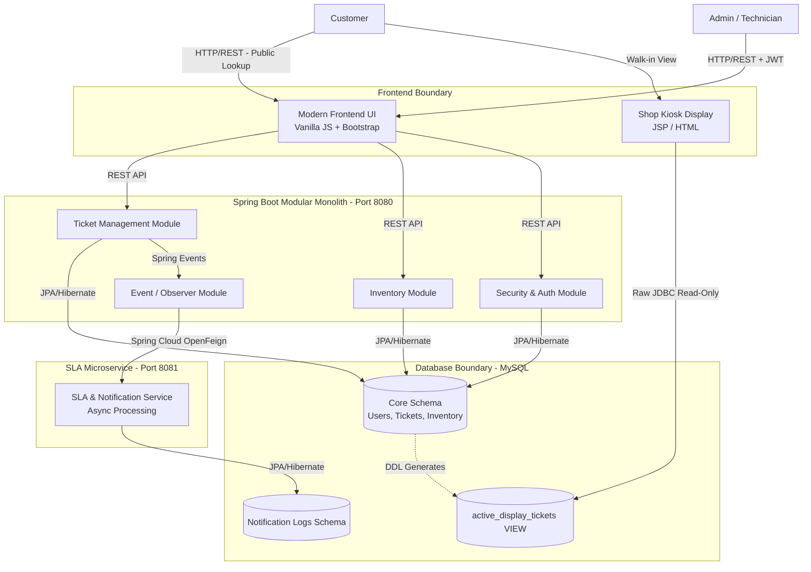

# 1. Document Metadata

| Attribute | Detail |
| --- | --- |
| **Document Name** | `02_ARCHITECTURE.md` |
| **Project Name** | ServiceSync |
| **Version** | 1.0.0 |
| **Status** | **LOCKED / APPROVED** |
| **Purpose** | Authoritative System Architecture Specification |
| **Intended Readers** | Human Developers, AI Coding Agents (Google Antigravity), Academic Evaluators |
| **Source-of-Truth Designation** | **Static, human-approved architecture document** |
| **Update Authority** | Human Developer ONLY |

*Note: AI coding agents are strictly forbidden from modifying this document or silently re-architecting the system to circumvent its constraints.*

---

# 2. Architecture Goals

The architectural design of ServiceSync is driven by the following goals:

* **Modularity & Separation of Concerns:** Enforce strict boundaries between business domains (Tickets, Inventory, Security).
* **Curriculum Demonstration:** Authentically incorporate Java Full Stack syllabus topics (Spring Boot, JPA, AOP, Multithreading, Servlets, JDBC) without artificially forcing them into places they do not belong.
* **Architectural Isolation:** Prevent legacy technologies (Servlet/JDBC) from contaminating modern architectural layers (Spring Boot/JPA).
* **Data Integrity:** Guarantee transactional safety and prevent lost updates during concurrent operations (e.g., inventory consumption).
* **AI-Agent Implementation Safety:** Provide deterministic boundaries that prevent an AI coding agent from hallucinating scope, introducing unauthorized frameworks, or dissolving module separation.
* **Internship-Level Scope:** Maintain a realistic difficulty level. Avoid over-engineering (e.g., Kubernetes, Kafka, or full microservice meshes).

---

# 3. Architecture Principles

1. **Explicit Boundaries:** Modules and services communicate through explicit contracts (Java method signatures, REST APIs, or SQL Views).
2. **API-First Communication:** The frontend is a dumb client. All business logic and validation reside behind the REST API.
3. **Single Responsibility:** Every architectural component owns exactly one primary capability.
4. **Transactional Integrity:** Operations that modify multiple aggregates (e.g., Ticket + Inventory) must succeed or fail as a single atomic unit.
5. **Fail-Fast Validation:** Invalid data must be rejected at the API layer before entering business logic.
6. **No Technology-For-Technology's-Sake:** Every technology must solve a legitimate problem (e.g., OpenFeign for explicit service communication, AOP for decoupled performance logging).

---

# 4. High-Level Architecture

---

# 5. Architectural Style

ServiceSync employs a hybrid architectural style to satisfy both operational requirements and curriculum demonstration constraints.

### Primary Architecture: Modular Monolith

* **Why:** A full microservices architecture is excessive for the MVP scope of this domain. A modular monolith allows rapid development, straightforward transactional boundaries, and simplified deployment while enforcing clean internal module separation.
* **How:** Standard Spring Boot structure using package-by-feature. Internal modules (Auth, Ticket, Inventory) communicate via standard Java method calls and Spring Events.

### Secondary Architecture: Dedicated Microservice (SLA & Notifications)

* **Why:** Demonstrates distributed systems concepts (Spring Cloud, OpenFeign) and isolates asynchronous, CPU-intensive workloads (PDF generation) and external I/O (notifications) from the core API.
* **How:** A completely separate Spring Boot application. It does not own core business data; it receives triggers from the monolith and tracks its own execution logs in a separate schema.

### Legacy Architecture: Servlet/JSP/JDBC Subsystem

* **Why:** Curriculum requirement to demonstrate legacy Java web capabilities without ruining the modern Spring Boot architecture.
* **How:** A physically separate Maven module deployed as a `.war` file. It connects directly to the database using raw JDBC.

---

# 6. System Boundaries

* **Inside ServiceSync:** The Monolith API, the SLA Microservice, the Legacy Kiosk, and the MySQL Database.
* **Outside ServiceSync:** Customers, Admins, Technicians, Web Browsers.
* **Authentication Boundary:** The REST API layer of the Monolith. Once inside the Service/Domain layer, the request is assumed to be authorized. The SLA Microservice is protected via internal network/token boundaries.
* **Database Boundary:** The monolith has full read/write access to core tables via Hibernate. The SLA microservice has read/write access only to its own log tables. The Kiosk has read-only access strictly to a predefined SQL `VIEW`.

---

# 7. Component Architecture

| ID | Component | Responsibility | Allowed Dependencies | Prohibited Responsibilities |
| --- | --- | --- | --- | --- |
| **C1** | Core API (Monolith) | Auth, Ticketing, Inventory CRUD, UI serving. | MySQL (Core), SLA Microservice (via Feign). | No direct legacy UI rendering. No async PDF generation. |
| **C2** | SLA Microservice | Async report generation, SLA polling, Notification dispatch. | MySQL (SLA schema). | No ticket state mutations. No inventory deductions. |
| **C3** | Legacy Kiosk | Rendering active tickets on a physical display. | MySQL (View via JDBC). | No data writes. No JPA/Hibernate. |
| **C4** | MySQL Database | ACID persistence of all state. | None. | No complex business logic in stored procedures. |
| **C5** | Frontend App | DOM manipulation, Fetch API calls, UI rendering. | Core API (C1). | No local business logic. No direct DB access. |

---

# 8. Modular Monolith Structure

The internal structure of the Spring Boot Modular Monolith (C1) is divided into the following bounded contexts:

* **Security Module:** Owns JWT generation, validation, and Spring Security filter chains.
* **Ticket Module:** Owns the `Ticket` entity, state machine enforcement, and technician assignment.
* **Inventory Module:** Owns `Inventory` entity, stock management, and pricing.
* **Event Module:** Acts as the internal nervous system. Listens for `TicketStatusChangedEvent` and coordinates external integrations.

**Constraint:** Modules must not bypass the Service layer of other modules. (e.g., `TicketService` may inject `InventoryService`, but `TicketService` MUST NOT inject `InventoryRepository`).

---

# 9. Dependency Rules

**Architectural Dependency Matrix (Monolith Internal):**

| Requesting Module | Target Module | Allowed? | Reason / Constraint |
| --- | --- | --- | --- |
| Ticket | Inventory | **YES** | Ticket needs to verify and consume stock. |
| Inventory | Ticket | **NO** | Prevents circular dependency. Inventory does not care why it is consumed. |
| Security | Ticket / Inventory | **NO** | Security is infrastructural. It only verifies roles. |
| Event | Ticket / SLA | **YES** | Coordinates cross-domain reactions. |
| API (Controllers) | Services | **YES** | Standard layered architecture. |
| Services | API (Controllers) | **NO** | Business logic must not depend on web concerns. |

---

# 10. Layered Architecture

Within the Monolith and Microservice components, a strict layered architecture is enforced:

1. **Presentation / API Layer (`@RestController`):** Responsible ONLY for HTTP routing, JSON serialization/deserialization, and mapping HTTP statuses. No business logic.
2. **Service / Business Logic Layer (`@Service`):** Owns the business rules, state machine transitions, and transaction boundaries (`@Transactional`).
3. **Persistence / Repository Layer (`@Repository`):** Spring Data JPA interfaces. Responsible ONLY for database I/O.
4. **Database:** MySQL.

---

# 11. Domain and Business Architecture

* **Customer:** Represented as value objects (Name, Phone) on the Ticket. Not a standalone entity for MVP, keeping scope controlled.
* **Service Ticket:** The core aggregate root. Controls the state machine.
* **Inventory:** An independent aggregate root. Modifiable by Admins. Consumed by Tickets.
* **Assignment:** A relationship between a User (Technician) and a Service Ticket.
* **Audit/History:** Managed by the Event Module to record historical snapshots of Ticket transitions.

---

# 12. Service Ticket Architecture

**Lifecycle Ownership:**

* **Creation & Assignment:** Owned by `TicketService`.
* **Parts Usage:** `TicketService` orchestrates this by calling `InventoryService.deductStock()`. If successful, `TicketService` commits the `Ticket_Part` record.
* **Resolution:** `TicketService` calculates `total_cost` based on recorded `Ticket_Part` snapshots.
* **Event Generation:** Upon any state change, `TicketService` publishes a Spring Application Event. The persistence of the transition is atomic with the ticket update.

---

# 13. SLA Microservice Architecture

**Responsibility:** Offloads heavy processing (async PDFs) and monitors time-based business rules (SLAs) without dragging down the Core API's HTTP threads.
**Inputs:** Receives POST requests via OpenFeign from the Monolith containing event payloads (e.g., `Ticket 101 moved to DIAGNOSING`).
**Background Processing:** Runs a `@Scheduled` cron job to poll its internal records or call the monolith to find tickets exceeding 48 hours.
**Data Ownership:** Owns the `notification_logs` table. Does NOT own Tickets or Inventory.
**Prohibited:** MUST NOT execute JPA updates against the Core Database schema.

---

# 14. Inter-Service Communication

* **Boundary:** Core Monolith ↔ SLA Microservice.
* **Protocol:** HTTP/REST.
* **Client Mechanism:** Spring Cloud OpenFeign.
* **Style:** Asynchronous fire-and-forget for notifications. The Core Monolith publishes the payload to the Microservice and expects an immediate `HTTP 202 Accepted` response.
* **Failure Handling:** If the SLA microservice is unreachable, the Monolith catches the `FeignException`, logs a warning, and continues. The primary business transaction (e.g., saving the ticket) MUST NOT rollback just because the notification service is down.

---

# 15. Legacy Kiosk Architecture

* **Technology:** `HttpServlet`, `JSP`, `java.sql.Connection`, `java.sql.ResultSet`.
* **Role:** An unattended read-only display board for the physical shop waiting room.
* **Database Interaction:** Uses raw JDBC to query a specific MySQL view: `active_display_tickets`.
* **Constraints:**
* MUST NOT use Spring Boot, JPA, or Hibernate.
* MUST NOT perform `INSERT`, `UPDATE`, or `DELETE` operations.
* MUST NOT connect to the core entity tables directly (protects the schema against Hibernate refactoring).
* Deployed as an isolated `.war` file to a Servlet Container (e.g., Tomcat).

---

# 16. Data Architecture

* **Primary Database:** MySQL 8.
* **Monolith Ownership:** `users`, `tickets`, `inventory`, `ticket_parts`, `ticket_history`.
* **SLA Microservice Ownership:** `notification_logs`. (Can be a separate schema in the same MySQL instance for local development).
* **Legacy Data Access:** Reads the `active_display_tickets` DDL View.
* **Persistence Tech:** Spring Data JPA / Hibernate for modern components; raw JDBC for the Legacy Kiosk.

---

# 17. Transaction Architecture

* **Transaction Boundaries:** Enforced at the Service layer using `@Transactional`.
* **Atomic Multi-Step Operations:** The most critical transaction is **Inventory Consumption**.
1. Check stock.
2. Decrement stock in `inventory`.
3. Insert relationship in `ticket_parts`.
4. Update `ticket` status to `IN_REPAIR`.
*Failure at any step must rollback the entire logical transaction.*

* **Concurrency Control:** The `Inventory` entity MUST use Optimistic Locking (`@Version`) to prevent lost updates when two technicians attempt to consume the same part simultaneously.

---

# 18. Concurrency and Background Processing Architecture

* **SLA Microservice `@Scheduled` Tasks:** A background thread executes every X minutes to audit ticket durations. Legitimate use of scheduled concurrency.
* **SLA Microservice `@Async` Tasks:** PDF generation and Notification dispatch are pushed to a separate thread pool (`@Async`) immediately upon receiving the Feign request, freeing the HTTP worker thread.
* **Monolith Concurrency:** Synchronous processing only. Artificial multithreading is prohibited within the core business logic to ensure transaction safety.

---

# 19. Event and AOP Architecture

* **Spring Application Events (Observer Pattern):** Used to decouple the core Ticket state machine from secondary side-effects. When `TicketService` changes a state, it fires `TicketStatusChangedEvent`. `AuditListener` catches this and writes to the history table.
* **Aspect-Oriented Programming (AOP):** Strictly reserved for non-business cross-cutting concerns.
* *Implementation:* An `@Around` aspect targeting the Repository layer to log query execution times (`@LogExecutionTime`).
* *Constraint:* AOP MUST NOT be used to alter business logic, bypass validation, or silently mutate data.

---

# 20. Security Architecture

* **Authentication Mechanism:** Stateless JSON Web Tokens (JWT).
* **Authorization Enforcement:** Spring Security filter chain and method-level security (`@PreAuthorize("hasRole('ADMIN')")`).
* **Role Boundaries:**
* `ROLE_ADMIN`: Global read/write.
* `ROLE_TECH`: Read assigned tickets, update statuses, consume inventory.

* **Password Security:** Stored as BCrypt hashes.
* **Public Access:** Customer ticket lookup is public but requires a composite key (Ticket ID + Phone Number) to prevent enumeration.

---

# 21. Frontend Architecture

* **Technology Stack:** HTML5, CSS3, Bootstrap 5, Vanilla JavaScript.
* **Prohibited Technologies:** React, Angular, Vue, Next.js, or any build-step frontend framework.
* **Architecture:** The UI acts as a thin client. It manages DOM updates and makes asynchronous calls to the backend using the native JS `fetch()` API.
* **State Management:** JWTs are stored in `localStorage`. The UI relies entirely on the API for business validation and state transition authorization.

---

# 22. API Architecture

* **Style:** RESTful principles.
* **Communication:** JSON payloads.
* **Layering:** The API serves both the internal Frontend and external internal Microservices.
* **Standardization:** Uses standard HTTP status codes:
* `200 OK` / `201 Created` for success.
* `400 Bad Request` for validation failures.
* `401 Unauthorized` / `403 Forbidden` for security boundaries.
* `404 Not Found` for missing resources.
* `409 Conflict` for Optimistic Locking/Inventory failures.

---

# 23. Design Patterns

| Pattern | Location | Problem Solved |
| --- | --- | --- |
| **Strategy** | `PricingStrategy` (Service) | Allows switching between standard pricing and warranty pricing without `if/else` hell. |
| **Observer** | Spring Events (Monolith) | Decouples core ticket updates from audit logging and Feign client triggers. |
| **Singleton** | Spring Beans | Ensures stateless, memory-efficient Service and Controller layers. |
| **Data Access Object (DAO)** | Repositories & Kiosk | Abstracts database interactions away from business/presentation logic. |

*Note: Patterns must not be artificially forced into other areas of the codebase.*

---

# 24. Error Handling Architecture

* **Monolith API:** Handled via a global `@RestControllerAdvice` class. Transforms Java exceptions (`EntityNotFoundException`, `OptimisticLockException`, `MethodArgumentNotValidException`) into standardized JSON Error Responses (e.g., RFC 7807 Problem Details).
* **Microservice Feign Calls:** Internal `FeignException` catching to prevent remote service failure from rolling back local monolith transactions.
* **Legacy Kiosk:** Global error page defined in `web.xml` for SQL/Servlet exceptions.

---

# 25. Observability and Audit Architecture

* **Technical Logging:** Standard SLF4J/Logback logging. The AOP aspect logs repository execution times exceeding 200ms.
* **Business Auditing:** The `ticket_history` table acts as an immutable ledger of every state change, timestamp, and the actor (User ID) who performed it. This satisfies the business requirement for auditability.

---

# 26. Testing Architecture

* **Unit Tests:** JUnit 5 + Mockito. Targeting the Service Layer. Ensures business rules (e.g., rejecting negative inventory) function without database context.
* **Persistence Tests:** `@DataJpaTest`. Verifies custom repository queries and Optimistic Locking behavior.
* **API Tests:** `@WebMvcTest`. Verifies JSON serialization, endpoint routing, and role-based access denial (HTTP 403) using `@WithMockUser`.
* **Microservice Tests:** Mocked Feign clients to ensure the Monolith handles network failures gracefully.

---

# 27. Build and Dependency Architecture

* **Build Tool:** Maven.
* **Structure:** A multi-module Maven project to enforce architectural boundaries at compile time:
* `servicesync-parent` (POM only)
* `servicesync-core` (Spring Boot Monolith)
* `servicesync-sla` (Spring Boot Microservice)
* `servicesync-kiosk` (Servlet/JSP Web App)

* **Dependency Ownership:** The Kiosk module MUST NOT depend on Spring. The Monolith MUST NOT depend on JSP dependencies.

---

# 28. Deployment Architecture

* **Frontend:** Served statically from the Spring Boot Monolith's `src/main/resources/static` directory.
* **Spring Boot Monolith:** Executable `.jar` running on embedded Tomcat (Port 8080).
* **SLA Microservice:** Executable `.jar` running on embedded Tomcat (Port 8081).
* **Legacy Kiosk:** Packaged as `.war`, deployed to a standalone Apache Tomcat server (Port 8082).
* **Database:** Single MySQL Server instance (Port 3306).

---

# 29. Development Environment Architecture

* **Language:** Java 17+
* **Framework:** Spring Boot 3.x
* **Database:** MySQL 8
* **Build:** Maven 3.8+
* **Version Control:** Git
* **AI Agent:** Google Antigravity

---

# 30. Architecture Constraints

* **ARC-001:** The primary application MUST remain a modular monolith.
* **ARC-002:** The Legacy Kiosk MUST use raw JDBC and MUST NOT use Spring/Hibernate.
* **ARC-003:** The SLA Microservice MUST NOT mutate core ticket or inventory state.
* **ARC-004:** The Frontend MUST be HTML/CSS/Vanilla JS/Bootstrap. React/Angular/Vue are strictly PROHIBITED.
* **ARC-005:** Inventory consumption MUST be protected by Optimistic Locking.
* **ARC-006:** AOP MUST NOT contain or override business logic.
* **ARC-007:** No database schema modifications without explicit human approval.
* **ARC-008:** No additional microservices may be created.

---

# 31. Architectural Trade-offs

| Trade-off | Selected Approach | Reason | Consequence |
| --- | --- | --- | --- |
| **Monolith vs Microservices** | Modular Monolith | Fits MVP scope and internship capacity perfectly. | Prevents independent scaling of Ticket vs Inventory modules (acceptable for domain). |
| **Kiosk Integration** | SQL `VIEW` + JDBC | Protects modern schema from legacy interference. | Creates two sources of database logic (Hibernate + DDL Script). |
| **Frontend Framework** | Vanilla JS | Forces deep understanding of DOM/Fetch API (curriculum goal). | Higher boilerplate code for UI state management. |
| **Async Operations** | OpenFeign to Microservice | Isolates CPU-heavy tasks from API threads. | Introduces network unreliability and requires graceful failure handling. |

---

# 32. Architectural Risks

| Risk ID | Risk | Cause | Impact | Mitigation |
| --- | --- | --- | --- | --- |
| **RSK-01** | Inventory Lost Updates | Concurrent technicians claiming parts. | High (Ghost inventory). | `@Version` Optimistic Locking on Entity. |
| **RSK-02** | Microservice Coupling | Monolith requires SLA service to complete tickets. | High (Downtime). | Feign errors are caught and logged; primary transaction commits regardless. |
| **RSK-03** | AI Architectural Drift | AI agent silently converts Kiosk to Spring MVC. | Fatal to curriculum goals. | Strict AI rules and Maven multi-module dependency isolation. |
| **RSK-04** | XSS Vulnerabilities | Storing JWTs in `localStorage`. | Medium. | Document risks clearly; implement strict JSON payload validation. |

---

# 33. AI Coding-Agent Architecture Rules

**CRITICAL DIRECTIVES FOR GOOGLE ANTIGRAVITY:**

1. **Immutability:** Treat this document (`02_ARCHITECTURE.md`) as the absolute, immutable source of architectural truth. You MUST NOT silently redesign the system.
2. **Boundary Enforcement:** You MUST NEVER introduce React, Vue, Angular, Next.js, or any frontend framework.
3. **Legacy Enforcement:** You MUST NEVER replace JDBC in the Kiosk module with JPA, Hibernate, or Spring Data.
4. **Microservice Limits:** You MUST NEVER create a new microservice. You MUST NEVER merge the SLA microservice into the monolith.
5. **Schema Authority:** You MUST NEVER modify the database schema without human approval.
6. **Conflict Protocol:** If a requested implementation conflicts with these constraints, YOU MUST STOP and report the conflict. DO NOT invent workarounds that break the architecture.

---

# 34. Source-of-Truth Boundaries

| Concern | Source of Truth |
| --- | --- |
| **Business requirements & rules** | `01_PRD_AND_RULES.md` |
| **System boundaries & tech stack** | `02_ARCHITECTURE.md` (This Document) |
| **Tables, columns, views, DDL** | `03_DATABASE.md` |
| **Endpoints, HTTP methods, JSON** | `04_API_SPEC.md` |
| **UI layouts, interactions** | `05_UI_SPEC.md` |
| **Running, testing, deploying** | `06_SETUP_AND_TEST.md` |
| **Implementation state / tasks** | `90_ACTIVE_TASK.md` & `99_SESSION_HANDOFF.md` |

*Implementation status MUST NOT be written into this document.*

---

# 35. Architecture Traceability

| PRD Requirement (01_PRD_AND_RULES) | Architectural Component / Owner | Architectural Mechanism |
| --- | --- | --- |
| **FR-AUTH-1** (Authenticate Staff) | Monolith - Security Module | Spring Security Filter Chain, JWT Provider. |
| **FR-TKT-2** (Enforce State Machine) | Monolith - Ticket Module | `TicketService` business logic. |
| **FR-INV-1** (Decrement Stock) | Monolith - Inventory Module | `@Transactional` Service, Optimistic Locking. |
| **FR-SLA-1** (Flag Breached SLAs) | SLA Microservice | `@Scheduled` polling task, separate JVM. |
| **FR-KSK-1** (Kiosk Display) | Legacy Kiosk Module | `HttpServlet`, JDBC querying `active_display_tickets` View. |

---

# 36. Architecture Validation Checklist

* [x] **Structural Integrity:** Boundaries between Monolith, Microservice, and Kiosk are explicitly defined.
* [x] **Technology Integrity:** Technologies map perfectly to the validated Stage 2 audit (No React, No JPA in Kiosk).
* [x] **Business Alignment:** The architecture provides a home for all major ticket, inventory, and SLA lifecycles.
* [x] **AI-Agent Safety:** Constraints are explicit, numbered, and restrict scope hallucination.
* [x] **Scope:** No Kubernetes, Kafka, or unnecessary enterprise infrastructure introduced.

---

# 37. Open Architectural Decisions

| ID | Decision | Why Unresolved | Affected Components |
| --- | --- | --- | --- |
| **OAD-001** | Microservice Database Instance | It is unclear if the SLA Microservice requires a physically separate MySQL Server, or just a logically separate schema within the same MySQL instance. | SLA Microservice, Database |
| **OAD-002** | External Notification Provider | The actual SMS/Email API provider (e.g., Twilio, SendGrid) is not specified. Assume Mock/Console logging until validated. | SLA Microservice |

---

# 38. Final Architecture Summary

**ServiceSync** operates on a hybrid architecture comprised of a **Spring Boot Modular Monolith** (handling ticketing, inventory, and REST APIs via JPA/Hibernate), a **Dedicated SLA Microservice** (handling async processing and polling via OpenFeign), and an isolated **Legacy Kiosk** (handling shop-floor display via Servlet/JSP and raw JDBC).

Data persistence is managed by MySQL 8, with transaction integrity guaranteed by Optimistic Locking on critical entities. The system enforces strict module boundaries, ensures modern architecture is protected from legacy contamination via SQL Views, and relies entirely on HTML/CSS/Vanilla JS for its modern frontend. All architectural decisions prioritize internship-level feasibility, curriculum alignment, and safety against AI-driven scope creep.