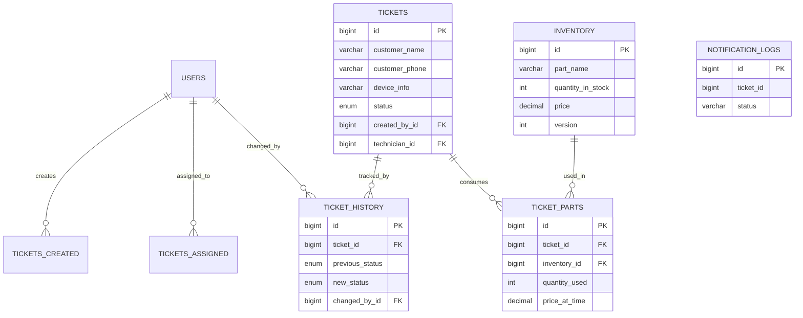

# 1. Document Metadata

| Attribute | Detail |
| --- | --- |
| **Document Name** | `03_DATABASE.md` |
| **Project Name** | ServiceSync |
| **Version** | 1.0.0 |
| **Status** | **LOCKED / APPROVED** |
| **Purpose** | Authoritative Database Architecture and Schema Specification |
| **Intended Readers** | Human Developers, AI Coding Agents (Google Antigravity), Database Administrators |
| **Source-of-Truth Designation** | **Static, human-approved database source of truth** |
| **Update Authority** | Human Developer ONLY |

*Note: AI coding agents are strictly forbidden from modifying this schema, introducing new persistence technologies, or bypassing data boundaries without explicit human approval.*

---

# 2. Database Architecture Overview

* **Database Technology:** MySQL 8.x.
* **Primary Database Purpose:** ACID-compliant persistence of all core operational state, user identities, inventory, ticket workflows, and historical audits.
* **Relationship to Spring Boot (Monolith):** The Spring Boot monolith interacts with the database exclusively via Spring Data JPA / Hibernate. It owns the core domain tables.
* **Relationship to Legacy Kiosk:** The Servlet/JSP kiosk interacts with the database exclusively via raw JDBC, querying a specifically constructed read-only SQL `VIEW` (`active_display_tickets`). It is strictly prohibited from accessing core tables directly or using an ORM.
* **Relationship to SLA Microservice:** The SLA Microservice maintains its own logical persistence boundary (`notification_logs`). It does not directly mutate the core ticketing or inventory tables.

---

# 3. Data Ownership Model

Explicit ownership prevents accidental coupling and unauthorized data mutation.

| Domain Concept | Persistent Data | Owning Component | Create/Modify Rights | Read Access |
| --- | --- | --- | --- | --- |
| **Users / Auth** | `users` | Security Module (Monolith) | Admin | Monolith |
| **Inventory** | `inventory`, `ticket_parts` | Inventory Module (Monolith) | Admin / Tech | Monolith |
| **Service Tickets** | `tickets` | Ticket Module (Monolith) | Admin / Tech | Monolith, Kiosk (via View) |
| **Audit History** | `ticket_history` | Event Module (Monolith) | Event Listener (System) | Monolith |
| **Notifications** | `notification_logs` | SLA Microservice | SLA Microservice | SLA Microservice |

---

# 4. Database Design Principles

* **Normalization:** 3rd Normal Form (3NF) is the baseline.
* **Referential Integrity:** Enforced exclusively via explicit MySQL Foreign Keys.
* **Controlled Denormalization:** Customer data (Name, Phone) is embedded in the `tickets` table as value objects to avoid unnecessary CRM complexity (validated by Stage 2 Architecture).
* **Concurrency Safety:** Optimistic locking via version columns is mandatory for concurrency-sensitive entities (Inventory).
* **Historical Preservation:** Prices are locked at the time of consumption (`price_at_time`) to ensure historical invoices remain immutable regardless of future inventory price changes.
* **Least Privilege:** The database user provisioned for the Legacy Kiosk must only have `SELECT` grants on the `active_display_tickets` View.

---

# 5. Conceptual Data Model

* **User:** Staff members (Admins and Technicians) who authenticate to operate the system.
* **Service Ticket:** The core aggregate root representing a customer's device, reported issue, and current status in the state machine.
* **Inventory Item:** A physical spare part available in the shop, with tracking for stock levels and base pricing.
* **Part Usage:** The transactional linkage denoting that a specific quantity of an Inventory Item was permanently consumed to repair a specific Service Ticket.
* **Ticket History:** An immutable audit log recording every transition of a Service Ticket's state.
* **Notification Log:** A record of async notifications (e.g., SLA breach alerts) dispatched by the microservice.

---

# 6. Entity Relationship Diagram



---

# 7. Naming Conventions

* **Tables:** `snake_case`, plural nouns (e.g., `tickets`, `users`).
* **Columns:** `snake_case`, singular nouns (e.g., `device_info`, `price`).
* **Primary Keys:** `id` (Always `BIGINT AUTO_INCREMENT`).
* **Foreign Keys:** `[target_entity_singular]_id` (e.g., `ticket_id`, `technician_id`).
* **Indexes:** `idx_[table]_[column]` (e.g., `idx_tickets_status`).
* **Unique Constraints:** `uq_[table]_[column]` (e.g., `uq_users_email`).
* **Timestamps:** `created_at`, `updated_at`, `resolved_at`.
* **Version Column:** `version` (Integer).

---

# 8. Core Table Specifications

### Table: `users`

| Column | Data Type | Nullable | Default | Key | Description |
| --- | --- | --- | --- | --- | --- |
| `id` | BIGINT | No | AUTO_INCREMENT | PK | Surrogate primary key. |
| `email` | VARCHAR(255) | No | None | UQ | Login identifier. |
| `password_hash` | VARCHAR(255) | No | None | None | BCrypt hashed password. |
| `role` | ENUM('ADMIN', 'TECH') | No | None | None | RBAC boundary constraint. |
| `name` | VARCHAR(100) | No | None | None | Display name. |
| `created_at` | TIMESTAMP | No | CURRENT_TIMESTAMP | None | Record creation time. |

### Table: `inventory`

| Column | Data Type | Nullable | Default | Key | Description |
| --- | --- | --- | --- | --- | --- |
| `id` | BIGINT | No | AUTO_INCREMENT | PK | Surrogate primary key. |
| `part_name` | VARCHAR(150) | No | None | None | Name of the spare part. |
| `sku` | VARCHAR(50) | No | None | UQ | Stock Keeping Unit identifier. |
| `quantity_in_stock` | INT | No | 0 | None | Current availability. |
| `price` | DECIMAL(10,2) | No | None | None | Current catalog price. |
| `last_updated` | TIMESTAMP | No | CURRENT_TIMESTAMP | None | Last modification time. |
| `version` | INT | No | 0 | None | Optimistic locking counter. |

### Table: `tickets`

| Column | Data Type | Nullable | Default | Key | Description |
| --- | --- | --- | --- | --- | --- |
| `id` | BIGINT | No | AUTO_INCREMENT | PK | Surrogate primary key. |
| `customer_name` | VARCHAR(100) | No | None | None | Customer's full name. |
| `customer_phone` | VARCHAR(20) | No | None | IDX | Used for public lookup auth. |
| `device_info` | VARCHAR(255) | No | None | None | Description of device (e.g., iPhone 12). |
| `issue_desc` | TEXT | No | None | None | Reported problem. |
| `status` | ENUM(...) | No | 'CREATED' | IDX | See Section 25 for ENUM values. |
| `created_by_id` | BIGINT | No | None | FK | References `users.id`. |
| `technician_id` | BIGINT | Yes | NULL | FK | References `users.id` (Assignee). |
| `total_cost` | DECIMAL(10,2) | Yes | NULL | None | Calculated at RESOLVED state. |
| `created_at` | TIMESTAMP | No | CURRENT_TIMESTAMP | None | SLA start clock. |
| `resolved_at` | TIMESTAMP | Yes | NULL | None | Completion timestamp. |

### Table: `ticket_parts`

| Column | Data Type | Nullable | Default | Key | Description |
| --- | --- | --- | --- | --- | --- |
| `id` | BIGINT | No | AUTO_INCREMENT | PK | Surrogate primary key. |
| `ticket_id` | BIGINT | No | None | FK | References `tickets.id`. |
| `inventory_id` | BIGINT | No | None | FK | References `inventory.id`. |
| `quantity_used` | INT | No | 1 | None | Amount consumed. |
| `price_at_time` | DECIMAL(10,2) | No | None | None | Preserves historical pricing. |

---

# 9. Identity and Authentication Data

* **Persistence:** The `users` table holds authentication data.
* **Security Constraint:** Passwords MUST be stored as BCrypt hashes. Plaintext storage is strictly forbidden.
* **Tokens:** JWTs are intentionally stateless. They are NOT persisted in the database.
* **OAuth2:** Deferred to Post-MVP (per Stage 2 Audit). No provider IDs or OAuth tokens are persisted in the MVP schema.

---

# 10. Customer Data Model

* **Design Choice:** Embedded Value Objects.
* **Implementation:** `customer_name` and `customer_phone` exist directly on the `tickets` table.
* **Reasoning:** Aligns with physical shop workflows where the transaction is tied to the device drop-off rather than an ongoing CRM relationship. Prevents unnecessary database complexity.

---

# 11. Service Ticket Data Model

The `tickets` table is the authoritative source for the state machine.

* **Identity:** `id` (Ticket Number).
* **Status Tracking:** The `status` column dictates the current state.
* **Lifecycle Timestamps:** `created_at` (starts the SLA clock) and `resolved_at` (finalizes the repair timeline).
* **Costing:** `total_cost` remains `NULL` until the ticket hits the `RESOLVED` state, at which point it is locked.

---

# 12. Technician and Assignment Data Model

* **Implementation:** Handled via the `technician_id` FK on the `tickets` table.
* **History:** Reassignment history is inherently captured by the `ticket_history` audit table. A dedicated `assignments` mapping table is unnecessary for this scope.

---

# 13. Diagnosis and Service Execution Data

* **Implementation:** Service execution is reflected entirely by changes to the `status` column (e.g., `DIAGNOSING`, `IN_REPAIR`) and the `issue_desc` field.
* **Notes:** Internal technician notes accompanying state changes are stored in the `notes` column of the `ticket_history` table.

---

# 14. Inventory Data Model

The `inventory` table represents physical catalog items. The `ticket_parts` table represents the immutable consumption of those items.

* **Integrity:** The `price_at_time` column in `ticket_parts` is mandatory. It copies the `price` from `inventory` at the exact millisecond of consumption, insulating the ticket from future catalog price changes.

---

# 15. Inventory Transaction and Concurrency Rules

**CRITICAL DATA INTEGRITY SECTION**

* **Negative Stock Prevention:** The database MUST enforce a check constraint: `CHECK (quantity_in_stock >= 0)`.
* **Simultaneous Consumption (Optimistic Locking):**
* The `inventory` table utilizes an integer `version` column.
* JPA translates this to `UPDATE inventory SET quantity_in_stock = ?, version = version + 1 WHERE id = ? AND version = ?`.
* If two technicians attempt to consume the final unit of stock simultaneously, one transaction will affect 0 rows, triggering an `OptimisticLockException` in the application layer, aborting the transaction cleanly.


---

# 16. SLA Data Model

* **Configuration:** Hardcoded in application logic (48 hours) as per PRD. No dynamic SLA configuration tables are required for MVP.
* **Runtime State:** Extracted dynamically by querying `tickets` where `status IN ('CREATED', 'DIAGNOSING')` and `created_at < (NOW() - INTERVAL 48 HOUR)`.
* **Breach Tracking:** Recorded by the SLA Microservice in the `notification_logs` table.

---

# 17. Notification Data Model

### Table: `notification_logs` (Logically owned by SLA Microservice)

| Column | Data Type | Nullable | Default | Key | Description |
| --- | --- | --- | --- | --- | --- |
| `id` | BIGINT | No | AUTO_INCREMENT | PK | Surrogate primary key. |
| `ticket_id` | BIGINT | No | None | None | Reference to monolith ticket. |
| `event_type` | VARCHAR(50) | No | None | None | e.g., 'SLA_BREACH', 'RESOLVED'. |
| `status` | VARCHAR(20) | No | None | None | 'SENT', 'FAILED'. |
| `sent_at` | TIMESTAMP | No | CURRENT_TIMESTAMP | None | Dispatch time. |

---

# 18. Audit Data Model

### Table: `ticket_history`

| Column | Data Type | Nullable | Default | Key | Description |
| --- | --- | --- | --- | --- | --- |
| `id` | BIGINT | No | AUTO_INCREMENT | PK | Surrogate primary key. |
| `ticket_id` | BIGINT | No | None | FK | The ticket being audited. |
| `previous_status` | VARCHAR(50) | No | None | None | State before transition. |
| `new_status` | VARCHAR(50) | No | None | None | State after transition. |
| `notes` | TEXT | Yes | NULL | None | Optional context/tech notes. |
| `changed_by_id` | BIGINT | No | None | FK | The user making the change. |
| `timestamp` | TIMESTAMP | No | CURRENT_TIMESTAMP | None | Exact time of change. |

---

# 19. Relationships and Cardinality

| Relationship | Cardinality | FK Location | Business Meaning |
| --- | --- | --- | --- |
| User → Ticket (Creator) | 1 : N | `tickets.created_by_id` | Admins create many tickets. |
| User → Ticket (Tech) | 1 : N | `tickets.technician_id` | Techs are assigned many tickets. |
| Ticket → TicketPart | 1 : N | `ticket_parts.ticket_id` | A ticket consumes many parts. |
| Inventory → TicketPart | 1 : N | `ticket_parts.inventory_id` | A catalog item is used many times. |
| Ticket → TicketHistory | 1 : N | `ticket_history.ticket_id` | A ticket has a trail of state changes. |

---

# 20. Referential Integrity

* `tickets.technician_id` → `users.id`: **RESTRICT**. Cannot delete a user if they have tickets assigned.
* `ticket_parts.inventory_id` → `inventory.id`: **RESTRICT**. Cannot delete an inventory item if it has been used on historical tickets. (Use soft-delete or active flags in application logic instead).
* `ticket_history.ticket_id` → `tickets.id`: **CASCADE**. If a ticket is purged (rare), its history is purged.
* `ticket_parts.ticket_id` → `tickets.id`: **CASCADE**. If a ticket is purged, its part allocations are freed.

---

# 21. Constraints

| ID | Constraint Type | Table | Definition |
| --- | --- | --- | --- |
| **DBR-001** | `CHECK` | `inventory` | `quantity_in_stock >= 0` |
| **DBR-002** | `UNIQUE` | `users` | `email` |
| **DBR-003** | `UNIQUE` | `inventory` | `sku` |
| **DBR-004** | `CHECK` | `ticket_parts` | `quantity_used > 0` |

---

# 22. Indexing Strategy

| Index Name | Table | Column(s) | Purpose |
| --- | --- | --- | --- |
| `idx_tickets_status` | `tickets` | `status` | Supports Kiosk view and SLA Microservice polling efficiently. |
| `idx_tickets_lookup` | `tickets` | `id`, `customer_phone` | Supports the public Customer lookup endpoint. |
| `idx_tickets_tech` | `tickets` | `technician_id` | Speeds up technician dashboard loading. |

---

# 23. Optimistic Locking and Concurrency

* **Table:** `inventory`
* **Column:** `version` (INT)
* **Semantics:** Every `UPDATE` to stock quantities increments the version.
* **Validation:** JPA validates that the version read matches the version updated. If mismatched, it throws `OptimisticLockException`. This protects the system from race conditions during simultaneous inventory consumption.

---

# 24. Timestamp and Temporal Data Strategy

* **Standard:** All timestamps are stored in UTC.
* **Creation Timestamps:** Mapped to `DEFAULT CURRENT_TIMESTAMP`.
* **Update Timestamps:** Handled by application layer (`@UpdateTimestamp` in Hibernate) to ensure business logic triggers update them accurately.
* **Nullability:** End-state timestamps (like `resolved_at`) are explicitly `NULL` until the event occurs.

---

# 25. Status and Enumeration Strategy

**Implementation:** Database `ENUM` type (Validated by Stage 2 Architecture).

* **User Roles:** `ENUM('ADMIN', 'TECH')`
* **Ticket Statuses:** `ENUM('CREATED', 'DIAGNOSING', 'WAITING_PARTS', 'IN_REPAIR', 'RESOLVED', 'CLOSED')`
* *Note: Using DB ENUMs strictly enforces the state machine at the database level, preventing rogue application code from inserting invalid states.*

---

# 26. Kiosk Data Access Model

* **Boundary:** The legacy Servlet/JSP kiosk MUST NOT access the `tickets` table directly.
* **Mechanism:** Raw JDBC.
* **Target:** Queries must target the `active_display_tickets` VIEW.
* **Privileges:** The kiosk application connects using a database user strictly limited to `SELECT` on the view.

---

# 27. Database Views

### View: `active_display_tickets`

* **Purpose:** Decouple the legacy JDBC kiosk from the Hibernate-managed entity tables. Provides a sanitized, read-only feed for the physical shop display.
* **Consumer:** Legacy Kiosk (Servlet).
* **Source Tables:** `tickets`.
* **Conceptual DDL:**
```sql
CREATE VIEW active_display_tickets AS 
SELECT id, device_info, status 
FROM tickets 
WHERE status != 'CLOSED';

```


---

# 28. Stored Procedures, Functions, and Triggers

**Explicit Architectural Decision:** NONE REQUIRED.

* **Reasoning:** Business rules (state transitions, SLA logic) belong in the Spring Boot Service layer to remain testable and version-controlled. Moving logic to triggers obscures business behavior and violates the architectural principles established in `02_ARCHITECTURE.md`.

---

# 29. Transaction Boundaries

| Operation | Tables Affected | Atomicity Required | Reason |
| --- | --- | --- | --- |
| **Consume Inventory** | `inventory`, `ticket_parts`, `tickets`, `ticket_history` | **YES** | If inventory deducts but `ticket_parts` fails, physical stock is lost to the system (Ghost Inventory). |
| **Change Status** | `tickets`, `ticket_history` | **YES** | State transition and audit log must commit together. |
| **SLA Polling** | `notification_logs` (read `tickets`) | **NO** | Async polling; microservice reads data but only commits to its own log. |

---

# 30. Database Access by Application Components

| Component | Access Method | Data Access Scope | Direct DB Access? |
| --- | --- | --- | --- |
| **Spring Boot Monolith** | JPA / Hibernate | `users`, `tickets`, `inventory`, `ticket_parts`, `ticket_history` | YES |
| **SLA Microservice** | JPA / Hibernate | `notification_logs` | YES (Logical boundary) |
| **Legacy Kiosk** | Raw JDBC | `active_display_tickets` VIEW | YES (Read-Only) |

---

# 31. JPA/Hibernate Mapping Considerations

* **Entity Mapping:** Direct mapping to the tables defined above.
* **Identifier Strategy:** `GenerationType.IDENTITY` leveraging MySQL `AUTO_INCREMENT`.
* **Relationships:** Favor `@ManyToOne` over `@OneToMany` to prevent unnecessary join tables and N+1 issues.
* **Lazy Loading:** All associations MUST be `FetchType.LAZY` by default. Eager loading is prohibited unless explicitly defined via `@EntityGraph`.
* **Optimistic Locking:** The `Inventory` entity MUST use `@Version`.

---

# 32. JDBC Requirements (Legacy Kiosk)

* **Statements:** Must use `PreparedStatement` exclusively to prevent SQL Injection, even for view querying.
* **Connections:** Must use a connection pool (e.g., HikariCP or Tomcat JDBC Pool) configured for read-only access.
* **Resource Management:** Must utilize try-with-resources blocks to ensure `ResultSet`, `Statement`, and `Connection` closure.

---

# 33. Database Initialization

A fresh development environment requires:

1. Execution of a schema creation script (DDL) defining all tables, constraints, and the `active_display_tickets` view.
2. Insertion of mandatory reference data (if any) and a baseline Admin user.

* **Tooling:** (See Section 43 - Open Database Decisions).

---

# 34. Seed and Reference Data

* **Mandatory Data:** None required for ENUMs. However, at least one Admin user must be seeded for system initialization.
* **Demo Data:** A separate profile should seed dummy inventory (e.g., "iPhone Screen", "DRAM") and sample tickets to facilitate frontend UI testing.

---

# 35. Backup, Recovery, and Data Retention

* **Expectations:** Proportional to an internship project. Daily logical backups via `mysqldump` are sufficient.
* **Retention:** `ticket_history` and `notification_logs` are retained indefinitely for the scope of the project. No archival strategy is implemented for MVP.

---

# 36. Database Security

* **Application Credentials:** The monolith and microservice should connect using a dedicated user (e.g., `servicesync_app`) with DML privileges.
* **Kiosk Credentials:** The legacy kiosk MUST connect using a highly restricted user (e.g., `servicesync_kiosk`) granted ONLY `SELECT` on `active_display_tickets`.
* **No Root Access:** The application must never connect as the `root` user.

---

# 37. Performance Considerations

* **N+1 Query Avoidance:** When the Monolith fetches a Ticket to calculate `total_cost`, it must use a `JOIN FETCH` (via `@Query` or `@EntityGraph`) to load `ticket_parts` in a single SQL statement.
* **SLA Polling Load:** The microservice polling queries `status IN ('CREATED', 'DIAGNOSING')`, heavily relying on `idx_tickets_status` to prevent full table scans.

---

# 38. Migration and Schema Evolution

* Schema changes require explicit human review.
* Destructive migrations (dropping columns/tables) are forbidden during the active implementation phase without updating this document.
* *(See Section 43 for tooling decision).*

---

# 39. Database Constraints for AI Coding Agents

**CRITICAL DIRECTIVES FOR GOOGLE ANTIGRAVITY:**

1. **Immutability of Truth:** Treat `03_DATABASE.md` as the authoritative source. You MUST NOT silently create, alter, or drop tables to suit your generated Java code. Your Java code must conform to this schema.
2. **No Persistence Redesign:** You MUST NEVER replace JDBC in the Legacy Kiosk with JPA/Hibernate. You MUST NEVER replace JPA/Hibernate in the Monolith with raw JDBC.
3. **Constraint Enforcement:** You MUST NOT weaken inventory rules (e.g., bypassing Optimistic Locking) to bypass test failures.
4. **No Extraneous Technologies:** You MUST NOT introduce MongoDB, Redis, or Kafka into this schema architecture.
5. **Conflict Resolution:** If JPA mappings conflict with this document, STOP and alert the user. Mark unresolvable gaps as `OPEN DATABASE DECISION`.

---

# 40. Source-of-Truth Boundaries

| Concern | Source of Truth |
| --- | --- |
| **Business Requirements & Rules** | `01_PRD_AND_RULES.md` |
| **System & Module Boundaries** | `02_ARCHITECTURE.md` |
| **Database Schema, Views, Locking** | `03_DATABASE.md` (This Document) |
| **API Endpoints & JSON Payloads** | `04_API_SPEC.md` |
| **UI Layouts & Behaviors** | `05_UI_SPEC.md` |
| **Configuration & Testing** | `06_SETUP_AND_TEST.md` |

---

# 41. Database Traceability

| PRD Requirement | Architecture Component | Database Entity / Mechanism | Integrity Mechanism |
| --- | --- | --- | --- |
| **FR-AUTH-1** (Login) | Monolith Security | `users` | BCrypt storage, Unique Email. |
| **FR-TKT-2** (State Machine) | Monolith Tickets | `tickets.status` | DB `ENUM` restriction. |
| **FR-INV-1** (Deduct Stock) | Monolith Inventory | `inventory`, `ticket_parts` | `CHECK(stock >= 0)`, `@Version` lock. |
| **FR-SLA-1** (SLA Breaches) | SLA Microservice | `notification_logs` | Asynchronous insert via polling. |
| **FR-KSK-1** (Kiosk Display) | Legacy Kiosk | `active_display_tickets` | Read-only SQL View via JDBC. |
| **Auditability** | Monolith Event | `ticket_history` | Transactional insert with ticket update. |

---

# 42. Schema Completeness Audit

* [x] **Entity Integrity:** All PRD business concepts (Tickets, Inventory, Users) have exact table mappings.
* [x] **Relationship Integrity:** Foreign keys strictly map assignment, consumption, and history.
* [x] **Business Integrity:** Inventory constraints (stock >= 0) and locked pricing (`price_at_time`) guarantee accurate billing.
* [x] **Concurrency:** Optimistic locking applied where risk exists (Inventory).
* [x] **Kiosk / Architecture:** `active_display_tickets` View isolates JDBC reads from modern Hibernate DDL.
* [x] **AI Safety:** Directives explicitly forbid silent schema drift.

---

# 43. Open Database Decisions

| Decision ID | Topic | Why Unresolved | Required Information | Affected Components | Consequence |
| --- | --- | --- | --- | --- | --- |
| **ODD-001** | **Migration Tooling** | The authoritative architecture (`02_ARCHITECTURE.md`) did not specify whether to use Flyway, Liquibase, or Spring Boot's native `hibernate.ddl-auto`. | Human validation on tool preference. | Build configuration, Initialization. | If unaddressed, environments will rely on unstable `update` DDL generation. |
| **ODD-002** | **Microservice DB Instance** | Unclear if the SLA Microservice requires a physically separate database server or just a logically separate schema (`notification_logs`) within the same instance. | Human validation on infrastructure complexity limit. | Setup, Deployment. | Minor environment setup variations. |

---

# 44. Final Database Summary

The **ServiceSync** database architecture relies exclusively on **MySQL 8.x**. The Spring Boot Monolith owns the primary persistence domain (`users`, `tickets`, `inventory`, `ticket_parts`, `ticket_history`) utilizing **JPA/Hibernate**, while the SLA Microservice controls its own logical persistence for asynchronous workloads (`notification_logs`).

To satisfy legacy curriculum requirements securely, the Servlet/JSP Kiosk utilizes **raw JDBC** strictly limited to querying the `active_display_tickets` View, physically preventing ORM contamination. Data integrity is guaranteed via explicit Foreign Keys, Database `ENUM` constraints for state machines, `CHECK` constraints to prevent negative inventory, and **Optimistic Locking** (`version`) to safely handle concurrent part consumption on the shop floor. Database evolution is strictly gated by human approval.