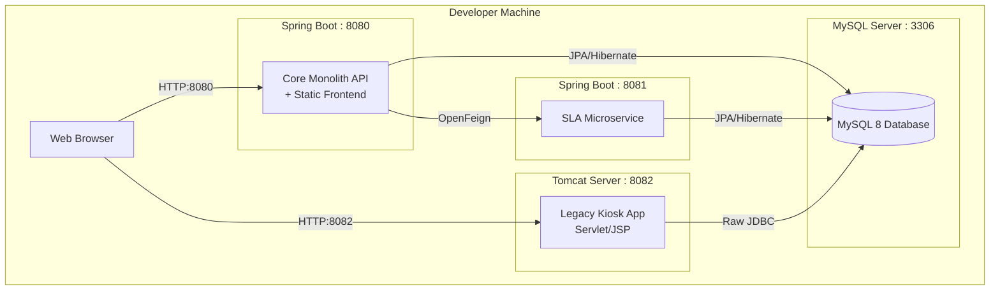

# 1. Document Metadata

| Attribute | Detail |
| --- | --- |
| **Project Name** | ServiceSync |
| **Document Name** | `06_SETUP_AND_TEST.md` |
| **Purpose** | Authoritative Setup, Build, Execution, Testing, and Validation Specification |
| **Version** | 1.0.0 |
| **Status** | **LOCKED / APPROVED** |
| **Authority** | Human Developer ONLY (AI coding agents must not modify this specification) |
| **Last Updated** | September 20, 2026 |
| **Source Documents** | Stage 2 Audit, `01_PRD_AND_RULES.md`, `02_ARCHITECTURE.md`, `03_DATABASE.md`, `04_API_SPEC.md`, `05_UI_SPEC.md` |
| **Dependency Documents** | None (Terminal configuration and setup specification) |
| **Classification** | Static, Human-Approved Setup/Test Source of Truth |

---

# 2. Setup and Testing Goals

The setup and testing architecture for ServiceSync is designed to ensure:

* **Reproducibility:** Any developer or AI agent can bootstrap the environment deterministically.
* **Local Development:** The entire system can run on a single local machine without requiring heavy enterprise or cloud infrastructure.
* **Database Consistency:** Persistence state is reliably initialized and verified across the monolith, microservice, and legacy boundaries.
* **Regression Prevention:** Automated test suites safeguard business logic, state machine transitions, and database constraints.
* **Boundary Enforcement:** Validation gates explicitly test inter-service communication (OpenFeign), legacy isolation (JDBC/JSP), and modern security (JWT/RBAC) to prevent architectural drift.

---

# 3. Environment Architecture



---

# 4. Prerequisites

| Tool | Purpose | Required | Version | Verification Command | Notes |
| --- | --- | --- | --- | --- | --- |
| **JDK** | Java compilation and runtime | Yes | 17+ | `java -version` | LTS version required for Spring Boot 3.x. |
| **Maven** | Build and dependency management | Yes | 3.8+ | `mvn -version` | Manages the multi-module project build. |
| **MySQL** | Relational database server | Yes | 8.x | `mysql -V` | Can be local native or via Docker container. |
| **Tomcat** | Servlet Container for Kiosk | Yes | 10.x | `catalina version` | Required for Jakarta EE 10+ Servlet/JSP support. |
| **Git** | Source code version control | Yes | 2.x+ | `git --version` |  |
| **Browser** | UI validation | Yes | Modern | N/A | Chrome, Firefox, or Edge. |

*Note: Exact minor versions are marked as `OPEN SETUP/TEST DECISION` if specific patching constraints arise during implementation.*

---

# 5. Repository Structure

The repository utilizes a multi-module Maven reactor structure to enforce architectural boundaries.

```text
servicesync/
├── backend/
│   ├── pom.xml                         # Parent POM (Dependency Management)
│   ├── servicesync-core/               # Monolith Spring Boot application
│   │   ├── src/main/java/              # Core domain, APIs, Security
│   │   ├── src/main/resources/         # application.yml
│   │   └── src/test/                   # Core unit and integration tests
│   ├── servicesync-sla/                # SLA Monitoring Microservice
│   │   ├── src/main/java/              # Async processing, Feign endpoints
│   │   ├── src/main/resources/         # application.yml
│   │   └── src/test/                   # Microservice tests
│   └── servicesync-kiosk/              # Legacy Servlet/JSP/JDBC application
│       ├── src/main/java/              # Servlets, JDBC DAO
│       ├── src/main/webapp/            # JSP files, web.xml
│       └── src/test/                   # Kiosk/JDBC tests
├── frontend/
│   └── servicesync-web/                # Active Angular 18 Frontend
├── database/                           # Database initialization scripts
└── docs/                               # Authoritative project documentation

```

---

# 6. Configuration Management

* **Application Configuration:** Handled via Spring Boot `application.yml` files inside `servicesync-core` and `servicesync-sla`. The Kiosk uses `web.xml` and properties files.
* **Server Ports:**
* Core Monolith: `8080`
* SLA Microservice: `8081`
* Legacy Kiosk (Tomcat): `8082`


* **Non-Secret Configuration:** Log levels, Hibernate DDL settings, and Tomcat port bindings are committed to Git.
* **Secret Configuration:** Passwords, JWT secrets, and API keys MUST NOT be committed. They are injected via Environment Variables.

---

# 7. Environment Variables and Secrets

| Variable | Purpose | Required | Secret | Example/Placeholder | Used By |
| --- | --- | --- | --- | --- | --- |
| `DB_URL` | MySQL connection string | Yes | No | `jdbc:mysql://localhost:3306/servicesync` | Core, SLA, Kiosk |
| `DB_USERNAME_APP` | Monolith/Microservice DB user | Yes | No | `servicesync_app` | Core, SLA |
| `DB_PASSWORD_APP` | Monolith/Microservice DB pass | Yes | Yes | `<DB_PASSWORD_APP>` | Core, SLA |
| `DB_USERNAME_KSK` | Restricted Kiosk read-only user | Yes | No | `servicesync_kiosk` | Kiosk |
| `DB_PASSWORD_KSK` | Kiosk DB pass | Yes | Yes | `<DB_PASSWORD_KSK>` | Kiosk |
| `JWT_SECRET` | Signing key for Auth tokens | Yes | Yes | `<JWT_SECRET>` | Core |
| `SLA_SERVICE_URL` | OpenFeign target URL | Yes | No | `http://localhost:8081` | Core |

*Exact OAuth2 variables (e.g., `GOOGLE_CLIENT_ID`) are currently deferred per PRD OAD-001.*

---

# 8. Database Setup

Based on the authoritative `03_DATABASE.md`:

1. **MySQL Availability:** Ensure MySQL 8.x is running on port 3306.
2. **Database Creation:** A database named `servicesync` must be created with `utf8mb4` character set.
3. **User Roles:** Two distinct database users must be created (`servicesync_app` with DML grants, and `servicesync_kiosk` with `SELECT` grants only on the View).
4. **No Destructive Testing:** Tests must not execute `DROP DATABASE` on the primary schema unless running in a designated isolated test profile.

---

# 9. Database Initialization

* **Mechanism:** `OPEN DATABASE SETUP DECISION` (Whether to use Flyway, Liquibase, or raw SQL scripts executed manually is pending human validation. For MVP, assume manual execution of a baseline `schema.sql` script located in `/database/`).
* **Sequence:**
1. Execute `01_schema.sql` (Creates tables, foreign keys, version columns).
2. Execute `02_views.sql` (Creates `active_display_tickets` View for the Kiosk).
3. Execute `03_seed_data.sql` (Inserts baseline Admin user required for first login).


---

# 10. Main Application Setup

* **Configuration:** Relies on `servicesync-core/src/main/resources/application.yml`.
* **Build:** Executed via Maven: `mvn clean install` from the `backend/` directory.
* **Startup:** Run the Core application via `mvn spring-boot:run -pl servicesync-core` from the `backend/` directory.
* **Verification:** Ensure the Spring Boot banner appears and the embedded Tomcat binds to port `8080`.
* **Health Check:** Access `http://localhost:8080/api/v1/public/tickets/ping` (or Spring Boot Actuator `/actuator/health` if configured) to verify API availability.

---

# 11. SLA Microservice Setup

* **Configuration:** Relies on `servicesync-sla/src/main/resources/application.yml`.
* **Database:** Connects to the same MySQL instance but manages only the `notification_logs` table.
* **Startup:** Run via `mvn spring-boot:run -pl servicesync-sla` from the `backend/` directory.
* **Verification:** Ensure it binds to port `8081`.
* **Failure Behavior:** If the core monolith cannot reach this service on port 8081, OpenFeign will throw an exception that the core monolith MUST catch and log without rolling back core ticket transactions.

---

# 12. Legacy Kiosk Setup

* **Architecture Enforcement:** The kiosk MUST NOT use Spring Boot or JPA.
* **Packaging:** Run `mvn clean package -pl servicesync-kiosk` from the `backend/` directory to generate a `.war` file.
* **Deployment:** Copy the resulting `servicesync-kiosk.war` to the `webapps` directory of a local Apache Tomcat 10.x installation.
* **Database Connection:** Configured via `WEB-INF/context.xml` or properties file loaded by the Servlet, pointing to `DB_URL` with `DB_USERNAME_KSK`.
* **Verification:** Start Tomcat and navigate to `http://localhost:8082/servicesync-kiosk` to verify the read-only JSP display is rendering.

---

# 13. Frontend Setup

* **Hosting:** The active modern frontend is an Angular application located at `frontend/servicesync-web/`. It runs completely independently from the backend and its development server is accessed via `http://localhost:4200/`.
* **Build Process:** Angular CLI requires Node.js. Run `npm install` and `npx ng build` (or `ng serve`) from `frontend/servicesync-web/`.
* **Configuration:** The frontend utilizes relative paths (`/api/v1/...`) to interact with the backend, eliminating CORS issues and avoiding hardcoded base URLs.

---

# 14. Full System Startup Sequence

To ensure stable initialization and avoid connection refused errors, start components in this order:

1. **Start MySQL:** Ensure port 3306 is listening.
2. **Initialize Schema:** Run database scripts if starting from scratch.
3. **Start SLA Microservice (Port 8081):** Ensure the listener is ready for OpenFeign calls.
4. **Start Core Monolith (Port 8080):** Connects to MySQL, hosts the REST API, and serves the static frontend.
5. **Deploy & Start Kiosk (Port 8082):** Start Tomcat to host the legacy `.war` application.
6. **Open Frontend:** Start Angular via `npx ng serve` inside `frontend/servicesync-web/` and navigate to `http://localhost:4200/` to begin UI testing.

---

# 15. Shutdown Sequence

To prevent corrupted states or broken connections, shutdown in this order:

1. Close browser sessions (Frontend).
2. Stop Tomcat server (Legacy Kiosk).
3. Stop Core Monolith (Ctrl+C in terminal).
4. Stop SLA Microservice (Ctrl+C in terminal).
5. Stop MySQL (if running locally as a manual process).

---

# 16. Build Architecture

* **Tool:** Apache Maven.
* **Dependency Resolution:** Managed via `dependencyManagement` in `servicesync-parent/pom.xml`.
* **Artifacts Generated:**
* `servicesync-core.jar` (Executable Spring Boot JAR).
* `servicesync-sla.jar` (Executable Spring Boot JAR).
* `servicesync-kiosk.war` (Standard Web Archive).


* **Clean Build Command:** `mvn clean install` executed at the `backend/` directory builds and tests all modules sequentially.

---

# 17. Git Workflow for Development

* **Branches:** `main` (stable/deployable), `develop` (integration), and feature branches (`feat/ticket-workflow`, `fix/inventory-bug`).
* **Commits:** Use imperative mood (e.g., "Add JWT authentication filter").
* **.gitignore:** MUST exclude `/target/` directories, `.idea/`, `.vscode/`, `*.log`, and any local `.env` or properties files containing actual secrets.

---

# 18. Testing Strategy

ServiceSync enforces a targeted testing pyramid:

1. **Unit Tests:** Business rules (state transitions, inventory logic).
2. **Database/Repository Tests:** Custom JPA queries, optimistic locking validation.
3. **API/Controller Tests:** Request validation, JSON serialization, security roles.
4. **Microservice Integration Tests:** Feign client mocking.
5. **Kiosk Tests:** Raw JDBC execution validation.
6. **End-to-End Workflows:** System-level validation of the PRD requirements.

---

# 19. Unit Testing

* **Target:** `@Service` classes, domain logic, state machine validation, utility classes.
* **Tools:** JUnit 5, Mockito.
* **Expectations:**
* Mock all repository dependencies.
* Test happy paths (e.g., successful ticket resolution).
* Test edge cases (e.g., attempting to consume part with `quantity=0` expects a domain Exception).
* Test state machine rules (e.g., transitioning from `CREATED` directly to `RESOLVED` fails).


---

# 20. Integration Testing

* **Target:** Spring context loading, `@DataJpaTest`, `@WebMvcTest`.
* **API-to-Database:** Verify that an HTTP request flowing through a controller correctly hits the service layer and returns the expected DTO.
* **Infrastructure:** Uses H2 in-memory database or a dedicated local MySQL test schema (`servicesync_test`).
* *(Note: Testcontainers is excluded from this MVP to preserve internship-level simplicity unless explicitly added later).*

---

# 21. Database Testing

* **Coverage Requirements:**
* Verify `@Version` Optimistic Locking prevents concurrent inventory consumption.
* Verify `Ticket` and `TicketPart` cascade behaviors (if any).
* Verify database `ENUM` mappings reject invalid strings natively.
* Verify custom `@Query` executions (e.g., fetching tickets by technician ID).


---

# 22. API Testing

| API Area | Test Category | Expected Behavior | Priority |
| --- | --- | --- | --- |
| **Auth** | Security | 401 on bad credentials, 200 + JWT on valid. | High |
| **RBAC** | Authorization | Tech role receives 403 when accessing Admin reports. | High |
| **Validation** | Request | 400 Bad Request on missing mandatory JSON fields. | Medium |
| **Ticketing** | Business Logic | 200 OK on valid status transition payload. | High |
| **Inventory** | Conflict | 409 Conflict when parts consumption fails DB rules. | High |

---

# 23. Security Testing

* **JWT Integrity:** Verify that tampered, expired, or malformed tokens yield an HTTP 401.
* **Authorization Enforcement:** Verify `@PreAuthorize` annotations protect service methods from unauthorized access.
* **Public Access Validation:** Ensure `GET /api/v1/public/tickets/{id}` properly validates the `phone` query parameter to prevent data leakage.
* **Sensitive Data:** Ensure `password_hash` is never serialized into User/Auth API JSON responses.

---

# 24. Microservice Testing

* **Main App ↔ SLA Service:**
* Test the `SlaFeignClient` using `@MockBean` to simulate network timeouts or HTTP 500 errors from the SLA service.
* Validate that the core monolith catches `FeignException` and completes the primary transaction (ticket update) without rolling back.


* **SLA Service Internals:** Unit test the `@Scheduled` polling logic and the async PDF/notification generation pathways.

---

# 25. Kiosk/JDBC Testing

* **Connectivity:** Test that standard `DriverManager.getConnection()` successfully authenticates using the restricted `servicesync_kiosk` user.
* **Query Execution:** Verify the `SELECT` statement properly parses the `active_display_tickets` View into a `ResultSet`.
* **Isolation Guarantee:** Explicitly review code to ensure no `EntityManager`, `Session`, or Spring Data annotations exist in the `servicesync-kiosk` module.

---

# 26. Frontend/UI Testing

* For the internship scope, UI validation is primarily manual, verified via browser interaction.
* **Validation Checklist:**
* JWT storage in `localStorage` works.
* DOM updates dynamically based on JWT Role.
* Fetch API handles `409 Conflict` by displaying a user-friendly alert, not crashing the page.
* Responsive layouts (Bootstrap grids) render correctly on desktop and mobile viewports.


---

# 27. End-to-End/System Test Scenarios

These scenarios must be manually or programmatically verified before system delivery:

* **Scenario A — Authentication:** Login as Admin → verify token received → access protected `/api/v1/inventory`.
* **Scenario B — Ticket Lifecycle:** Admin creates ticket → Tech assigned → Tech transitions to `DIAGNOSING` → Tech transitions to `RESOLVED`.
* **Scenario C — Inventory Contention:** Ticket requires part → Tech attempts usage → stock = 0 → API returns `409` → UI shows error.
* **Scenario D — SLA Trigger:** Ticket state changed → Event published → Feign client sends payload to Microservice → Microservice returns `202 Accepted`.
* **Scenario E — Kiosk Display:** Kiosk loaded in browser → Ticket is `IN_REPAIR` (visible) → Ticket moves to `CLOSED` → Ticket disappears from Kiosk on next refresh.

---

# 28. Test Data Strategy

* **Development Data:** Inserted via manual SQL scripts (or initialized by `data.sql`) to provide baseline users, 5-10 inventory items, and a few open tickets.
* **Test Isolation:** Automated JUnit tests must utilize `@Transactional` test rollbacks to ensure database state is pristine for each test method.
* **Reset Mechanism:** `OPEN SETUP/TEST DECISION` (Whether to use Spring `@Sql` scripts, manual teardowns, or an in-memory DB for integration testing is pending implementation choices).

---

# 29. Test Environment Configuration

* Use `src/test/resources/application-test.yml` to override production properties (e.g., pointing the database URL to `jdbc:h2:mem:testdb` or `jdbc:mysql://localhost:3306/servicesync_test`).
* Ensure the `JWT_SECRET` in the test environment is a static dummy value to allow predictable token generation in tests.

---

# 30. Health Checks and Verification

* **MySQL:** `mysqladmin -u root -p ping` (Expect: `mysqld is alive`).
* **Monolith API:** `GET /api/v1/public/tickets/ping` (Expect: `200 OK`).
* **SLA Microservice:** Start logs display successful Tomcat initialization on port 8081.
* **Legacy Kiosk:** Browse to `http://localhost:8082/servicesync-kiosk/` (Expect: HTML page displaying a table).

---

# 31. Definition of Done / Validation Gate

A feature is considered complete only when:

1. **Build Passes:** `mvn clean install` completes with `BUILD SUCCESS` on all modules.
2. **Tests Pass:** Unit, integration, and architectural constraint tests execute without failure.
3. **API Compliant:** Endpoints strictly match the contracts in `04_API_SPEC.md`.
4. **Database Compliant:** Schema strictly matches `03_DATABASE.md` (no rogue tables).
5. **Workflows Functional:** E2E Scenarios A through E can be successfully executed via the UI.
6. **Architecture Intact:** No prohibited technologies (e.g., React, JPA in kiosk) have been introduced.

---

# 32. Troubleshooting Guide

| Symptom | Likely Cause | Verification / Fix |
| --- | --- | --- |
| **Port 8080 already in use** | Another service (or previous run) didn't shutdown. | `lsof -i :8080`, kill process, or change port in `application.yml`. |
| **Access Denied for user 'servicesync_app'** | MySQL credentials mismatch. | Verify `DB_PASSWORD_APP` env variable matches DB creation scripts. |
| **403 Forbidden on API calls** | JWT token expired or Role mismatch. | Verify local storage token; check `@PreAuthorize` rules. |
| **Kiosk displays HTTP 500** | Tomcat cannot find MySQL driver or DB is down. | Check Tomcat `catalina.out` logs; ensure `mysql-connector-j` is in Kiosk POM. |
| **FeignException in Monolith logs** | SLA Microservice is down. | Ensure port 8081 service is running. Monolith should log and continue. |

---

# 33. Common Development Mistakes

**AI Agents and Developers MUST AVOID:**

* Silently adding new database tables or columns without updating `03_DATABASE.md`.
* Replacing Vanilla JS in the frontend with React/Vue because "it's easier".
* Injecting JPA repositories or Spring Data dependencies into the `servicesync-kiosk` module.
* Committing `JWT_SECRET` or database passwords to source control.
* Commenting out failing tests (`@Disabled`) just to achieve a green build.
* Creating inter-module circular dependencies between Ticket and Inventory services.

---

# 34. CI/CD Expectations

* **Status:** `OPEN SETUP/TEST DECISION`.
* **Conceptual Pipeline (If implemented later):**
* *Commit Push* → *Maven Build* → *Unit Tests* → *Integration Tests* → *Package (JAR/WAR)*.


* As an internship-level local project, a formal GitHub Actions or GitLab CI pipeline is not strictly required for MVP completion, but the Maven build must cleanly support it.

---

# 35. AI Coding-Agent Setup/Test Rules

**CRITICAL DIRECTIVES FOR GOOGLE ANTIGRAVITY:**

1. **Read Context:** You MUST read `00_MASTER_CONTEXT.md` and all static `01` through `05` documents before touching build or test configurations.
2. **Immutability:** Treat `06_SETUP_AND_TEST.md` as the authoritative setup contract. Do not invent new required infrastructure (e.g., Docker Compose files for Redis) unless explicitly authorized.
3. **No Fabricated Tests:** Do not generate test cases that contradict the PRD (e.g., asserting a customer can delete a ticket when the PRD forbids it).
4. **No Silent Alterations:** If a test fails because of a flaw in your implementation, FIX THE IMPLEMENTATION. Do not delete the test or silently modify this document.
5. **Environment Variables:** Do not invent new environment variables. Use only those defined in Section 7.
6. **Conflict Resolution:** If setup requirements are unclear or block implementation, halt and record an `OPEN SETUP/TEST DECISION`.

---

# 36. Source-of-Truth Boundaries

| Concern | Authoritative Source |
| --- | --- |
| **Business Behavior & Workflows** | `01_PRD_AND_RULES.md` |
| **System & Runtime Topology** | `02_ARCHITECTURE.md` |
| **Database Schema & Data Model** | `03_DATABASE.md` |
| **REST API Contracts** | `04_API_SPEC.md` |
| **Frontend UI Contract** | `05_UI_SPEC.md` |
| **Setup, Build, Test & Validation** | `06_SETUP_AND_TEST.md` (This Document) |
| **Session State & Active Tasks** | Dynamic Documents (`90_ACTIVE_TASK.md`, etc.) |

---

# 37. Setup/Test Traceability Matrix

| Component | Setup Requirement | Test Requirement | Validation Method |
| --- | --- | --- | --- |
| **Monolith** | Maven, JDK 17, Port 8080 | JUnit, Mockito, `@WebMvcTest` | `mvn clean test -pl servicesync-core` |
| **SLA Service** | Maven, JDK 17, Port 8081 | JUnit, Microservice Integration | `mvn clean test -pl servicesync-sla` |
| **Legacy Kiosk** | Tomcat 10, Port 8082 | JDBC validation, SQL View check | Deploy `.war`, manual browser verification |
| **Database** | MySQL 8, Initial DDL | Concurrency locks, FK constraints | `@DataJpaTest` integration tests |
| **Frontend** | Static HTML hosting in Core | Form validation, Fetch API errors | Manual browser verification (Scenarios A-E) |

---

# 38. Completeness Audit

* [x] **Environment:** JDK, Maven, MySQL, Tomcat, and Git prerequisites are defined.
* [x] **Configuration:** Environment variables and secrets management are established.
* [x] **Build & Runtime:** Multi-module Maven commands and port bindings are clear.
* [x] **Testing:** Pyramid structure defined without introducing bloated frameworks.
* [x] **Validation:** Clear Definition of Done and E2E scenarios provided.
* [x] **AI Safety:** Explicit instructions forbid test deletion, silent config changes, and infrastructure inflation.

---

# 39. Open Setup/Test Decisions

| Decision ID | Topic | Current Ambiguity | Required Decision | Impact |
| --- | --- | --- | --- | --- |
| **OST-001** | **Database Migration Tool** | `03_DATABASE.md` left migration tooling open. | Choose manual SQL, Flyway, or Liquibase. | Determines DB init steps in automated tests. |
| **OST-002** | **Integration Test DB** | Exact test environment DB strategy is unstated. | Choose H2 in-memory vs. separate MySQL schema. | Affects test speed and MySQL dialect accuracy. |
| **OST-003** | **CI/CD Platform** | No specific platform defined in source docs. | Adopt GitHub Actions, GitLab CI, or none. | Determines if pipeline YAML files need generating. |

---

# 40. Final Setup and Test Summary

The **ServiceSync** environment relies on a standard Java Full Stack toolchain: **JDK 17+, Maven 3.8+, MySQL 8.x, and Tomcat 10.x**. The multi-module Maven reactor (`servicesync-parent`) independently builds the Spring Boot Monolith (`8080`), the SLA Microservice (`8081`), and the legacy Servlet Kiosk `.war` (`8082`).

Configuration is driven by Spring `application.yml` files and strictly protected environment variables for secrets (`DB_PASSWORD`, `JWT_SECRET`). Testing follows a structured pyramid utilizing **JUnit 5, Mockito, and Spring Boot Test** to validate business logic, API contracts, and database integrity (optimistic locking), while explicitly avoiding unnecessary heavyweight infrastructure. Validation is gated by objective completion metrics, ensuring architectural boundaries are proven before the system is marked complete.